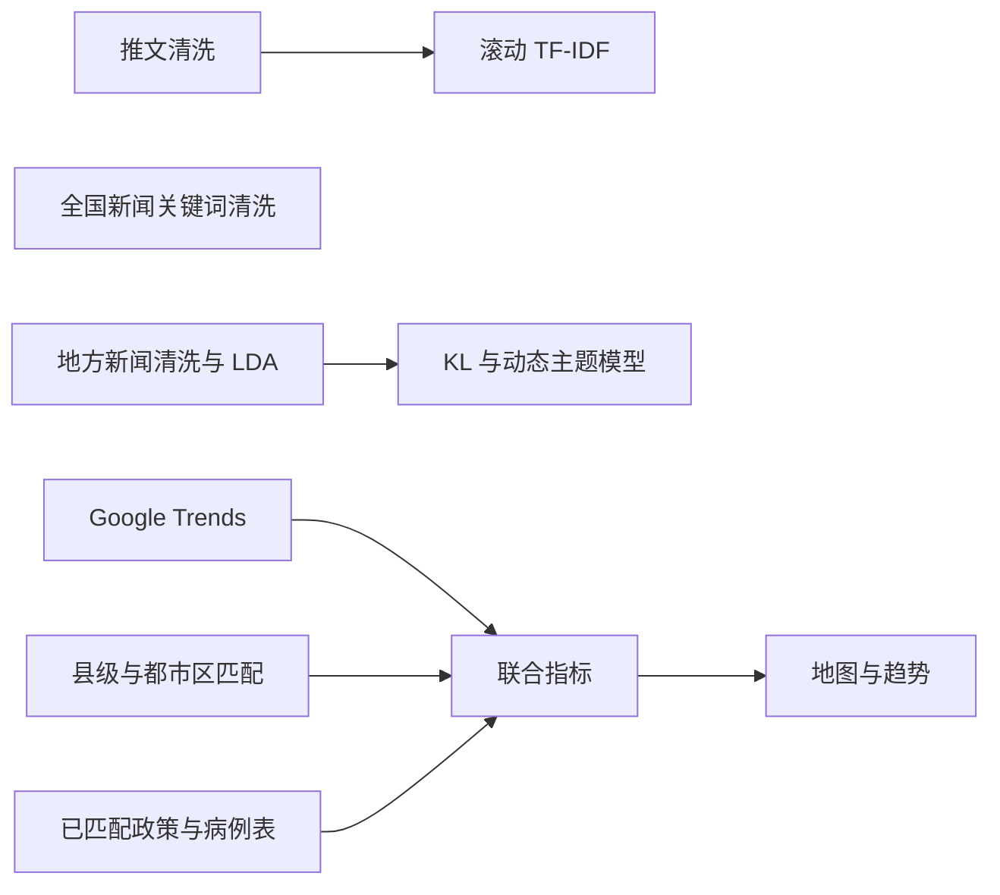

# COVID 信息传播与出行行为研究

本科暑期科研资料，分析 COVID 相关推文、地方新闻、公众搜索关注度，并整理美国县级出行、政策与病例指标。项目包括三条路线：推文清洗与滚动 TF-IDF、新闻主题与新颖度分析、出行与政策数据匹配。这些是探索性分析，不把共同变化直接解释为因果关系。

## 目录与运行路线

| 顺序 | 笔记本 | 输入与产出 |
| --- | --- | --- |
| T1 | [推文清洗](notebooks/tweets/01-cleaning.ipynb) | Pittsburgh 推文 → 去重、词形还原、词性筛选 → 含转推与仅原创的六组每日文档 |
| T2 | [滚动 TF-IDF](notebooks/tweets/02-rolling-tfidf.ipynb) | T1 的文档 → 滚动词权重、日均指标、平滑曲线与热图 |
| N1（独立） | [全国新闻关键词清洗](notebooks/news/01-national-news-cleaning.ipynb) | 已整理的关键词 → 全词、名动词、名词三组每日文档 |
| N2 | [地方新闻 TF-IDF 与 LDA](notebooks/news/02-local-news-topics.ipynb) | KDKA 新闻 → 标题、关键词、正文、标题加关键词四组文档 → LDA 与每日主题占比 |
| N3 | [主题散度与动态主题模型](notebooks/news/03-topic-divergence.ipynb) | N2 文档与模型 → KL 新颖度；另含 Gensim 动态主题实验 |
| M1 | [Google Trends](notebooks/mobility/01-google-trends.ipynb) | 地理代码表与在线采集 → 按日、按地区搜索关注度 |
| M2 | [县级出行、政策与都市区匹配](notebooks/mobility/02-county-policy-matching.ipynb) | 已格式化出行、政策与地理表 → 匹配检查和都市区到县的映射 |
| M3 | [联合指标](notebooks/mobility/03-combined-indicators.ipynb) | 出行、已匹配政策、病例及 M1/M2 产出 → 两份联合指标表 |
| M4 | [地图与趋势](notebooks/mobility/04-visualization.ipynb) | M3 产出 → 县级地图与都市区曲线 |



N1 是独立路线；T2 只处理推文，地方新闻集中在 N2/N3。M2 的人工匹配与部分外部预处理仍需完成，以上路线不是无人值守流水线。

## 环境与路径

从本项目根目录开始：

```sh
python -m venv .venv
# Windows PowerShell；macOS/Linux 使用 source .venv/bin/activate
.venv/Scripts/Activate.ps1
python -m pip install -r requirements-notebooks.txt
python -m nltk.downloader stopwords wordnet omw-1.4 punkt punkt_tab averaged_perceptron_tagger averaged_perceptron_tagger_eng
python project_paths.py
jupyter lab
```

推文路线只需 `requirements.txt`；新闻与出行路线另用 `requirements-notebooks.txt`。依赖来自实际导入，未锁定所有实验版本。

每本笔记本首个代码单元定位项目根目录，再进入对应数据工作目录：`data/tweets/`、`data/national-news/`、`data/news/`、`data/mobility/`，以及 `data/mobility/trends/`。启动 Jupyter 前可设置 `COVID_DATA_DIR` 指向独立数据副本；切换后重启内核。

`python project_paths.py` 只检查主要输入是否存在，缺文件时列出路径并返回非零状态，不联网、不生成替代数据。详细文件名、关键字段及中间产物见 [数据说明](data/README.md)。运行会写结果，部分清洗单元会更新停用词文件，请使用独立的数据工作副本。

## 修复内容

- 九本笔记本按主题与顺序组织，去除重复清洗副本和执行输出；推文笔记本中混入的地方新闻分析归入新闻路线。
- 修复名动词、名词结果被完整文本覆盖，及全国新闻名词输出误用名动词表；不再用旧 CSV 覆盖刚清洗的内存结果。
- 修复推文删除字段列表漏逗号、空标题问题；地方新闻清洗显式检查字段，移除阻断自动执行的 `input()`。
- 共享滚动 TF-IDF，使用 `max_df=1.0` 表示文档比例，避免整数 `1` 意外过滤重复词；全空窗口保留缺失指标，重复或无序日期报错。参数语义见 [scikit-learn 文档](https://scikit-learn.org/1.5/modules/generated/sklearn.feature_extraction.text.TfidfVectorizer.html)。
- 文本按指定列聚合，避免依赖 `groupby.apply` 的分组列行为；出行数据用带重复键检查的 pivot。相关语义见 [pandas 文档](https://pandas.pydata.org/docs/reference/api/pandas.api.typing.DataFrameGroupBy.apply.html)。
- FIPS 保留前导零，不静默截断非整数；地方政策补全仅填缺失值，保留已有日期。
- 动态主题模型按位置过滤空词袋，使重复文本、日期与时间片对齐；修正测试语料长度和时间片之和不一致的问题。
- 接通 Google Trends 与都市区映射的保存路径，补上 `combined_info_with_dl.csv` 的生成步骤供地图读取。

## 验证与完整度

```sh
python -m pip install pytest nbformat ipython
python -m pytest -q
```

回归检查覆盖笔记本格式/语法、TF-IDF、词性列保留、政策补全、FIPS、重复键拒绝、动态主题时间对齐及路径隔离。人工小样本只用于代码检查，不是科研数据或结果。

测试环境：Python 3.13、NumPy 2.5.3、pandas 3.0.5、SciPy 1.18.1、scikit-learn 1.9.0。没有执行真实数据的完整流程、新闻模型全量训练、在线采集或地图绘制。

仍缺原始 CSV、项目停用词、地理对照表及部分已格式化数据；词云还可能需要单元指定的蒙版或字体。新闻模型参数搜索、特定地区人工修正、全国新闻截取前 53 行等实验选择需要结合数据确认。模型与向量器词表必须匹配，不能混用不同训练批次。

Google Trends 保留请求间隔，采集时需检查错误列表与服务可用性；不能保证重新获得完全相同的历史序列。完整研究复现仍取决于数据与环境恢复。
