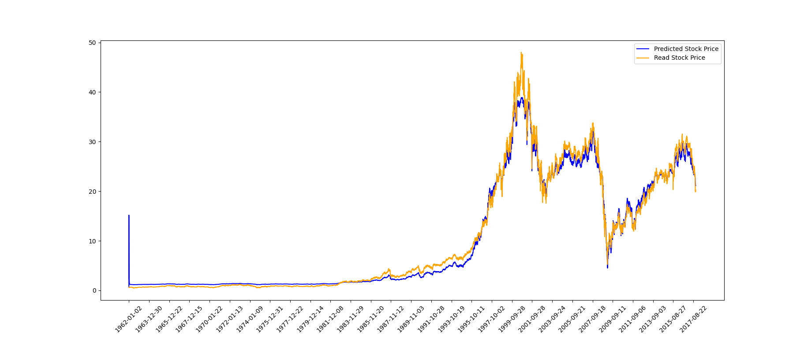

# GatedUnitsInRNN

GRU and LSTM implementation in PyTorch for StockPrediction, retained as a CMIT teaching example.

Run from this folder, with the CMIT dependencies installed:

```sh
python train.py --epochs 2 --max-rows 48
python visualize_stock.py
```

`datasets.py` reads Date/High/Low, sorts unique dates, and returns disjoint chronological training/test arrays. `train.py` fits scaling only on training data, trains the custom cells in `models.py` through `network.py`, and resets state for evaluation without retaining a gradient graph. These cells retain their teaching equations; they are not replacements for the standard PyTorch LSTM/GRU implementations.

Remove `--max-rows` for the full CSV. Training starts fresh and writes no file unless `--output` is specified; a supplied output path must not exist. The existing `checkpoint.pt` is preserved and is not automatically loaded. Saved checkpoints contain model weights, test loss and the training scaler parameters.

Regression checks live at the CMIT project root: `python -m unittest -v`. See the [CMIT guide](../../../../README.md) for the full environment and notebook routes.

## Retained historical illustration

The following image is part of the teaching material, not a result from the current smoke run:


